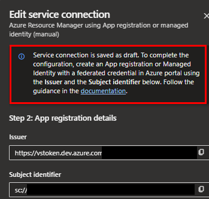
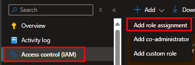

# Azure DevOps Service Connection

The following describes how to create an Azure DevOps Service Connection and Azure App Registration for cross Tenant authentication where the Azure DevOps Origanisation is a member of `Entra Tenant A` but the Azure subscription is a member of `Entra Tenant B`.

In this scenario we are unable to use the automatic creation workflow using Azure DevOps in `Entra Tenant A`, which would create the required App registration automacially and assign the required Azure role assignment if both were both the same Entra Tenant.

The following portal experience is required to complete the Azure DevOps project service connection App registration/Service Principle to be used for authentication and authorisation to deploy Azure DevOps pipelines.

For the purpose of this document the Azure Subscription is named `Contoso` with short name `con`.

**Create a DevOps Variable Group or Azure Keyvault to store the following sensitive key values.**

- Application Client ID `clientId`
- Directory Tenant ID `tenantId`
- Subscription ID `subscriptionId`
- Issuer `issuer`
- Subject Identifier `subjectIdentifier`

**Please use the remaining as stated.**

- Service Connection Name `sc-con-infrastructure`
- Description `Service Connection for Azure DevOps pipeline deployments`
- Subscription Name `Contoso`
- App Registration Name `sp-ado-con-infrastructure`

## Create the Azure DevOps Service connection

01. In the Azure DevOps Organisation goto the project containing the Azure subscription repository.

`https://dev.azure.com/<Organisation>/<Project>/`

02. Now browse to `Project Settings > Pipelines Service Connections`

Cross-Tenant-DevOps-ServiceConnection\.images\adosc.png

03. Create service connection

04. For the `Choose a service or connection type` Select `Azure Resource Manageger` and select Next.

05. For the `identity type` select in the dropdown `App Registration or managed identity (manual)`

06. Credential set as `Workload identity federation` this is the Open ID connect (OIDC). Add the Service connection name and optional description then select next.

07. On the next screen you will be presented with the following screen informing the user that the `The service connection is saved in draft`. Copy the `Issuer` ans the `Subject identifier`, copy and save both values they are required when creating the Entra App registration or managed identity. 

Note also that the alpanumeric value for the subject identifier is a unique identifier for your Azure DevOps organization, this is what ties the App registration or managed identity to the DevOps orgnisation service connection.

Close the window refresh your page and you will see the new draft service connection.

## Create the App registration or managed identitiy.

In Azure you have two options, create a user assigned managed identity or App registration. Where the user has no access to Entra then use the `user assigned managed identity` option, the down side to this is that the identity is region specific i.e. it is deployed to a regional reource group. Therefore you need to think about DR scenario. App regastration therefore is the prefrred option due to it global significance not tied to any specific region.

For the purpose of this document we will focus on App registration process.

01. Log into Azure and search for `Microsoft Entra ID` under manage select `App Registrations` the `New Registration`.

02. Give the App registration a name and select `Accounts in this organisational directory` then register.

03. On the next screen select `Certificates & secrets` and select the tab for `Federated credentials` and the `+ Add Credential`

04. For the `Federated credential scenario` select `Other issuer`. Add the output saved from the service connection creation workflow in the format `https://vstoken.dev.azure.com/<devops-organisationid>` in the Issuer field. Keep the Type as default `Explicit subject identifier` and the oputput saved from the service connection workflow in the format `sc://<DevOpsOrganisationName>/<DevOpsProjectName>/<service-connection-name>` in the Value field.

05. On the Overview screen copy the `Application (client) ID` and the `Directory (tenant) ID` this will be used along with the `Subscription Name` and the `Subscriptyion ID` to complete the service connection setup.

06. Give the new service App regstration either the Contributor role at the subscription scope. Goto `Subscriptions > Access Control (IAM) > + Add > Add role assignement`.

07. Select `Priviledged administrator roles` and select the `Contributor` Role and hit next.

08. For assigned access to select `User, group or service principle`

09. In the search by name or email address add the name `sp-ado-con-infrastructure` and hit select then review and assign.

07. Move back to the Azure DevOps service connection and select finish setup. Add the `Application (client) ID`, `Directory (tenant) ID` and the `Subscription Name` and the `Subscriptyion ID` to the service connection fields. Finally test authentication with the `Verify and save`

